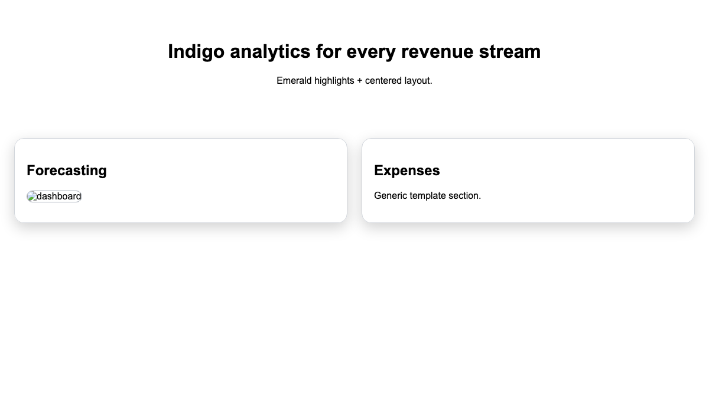
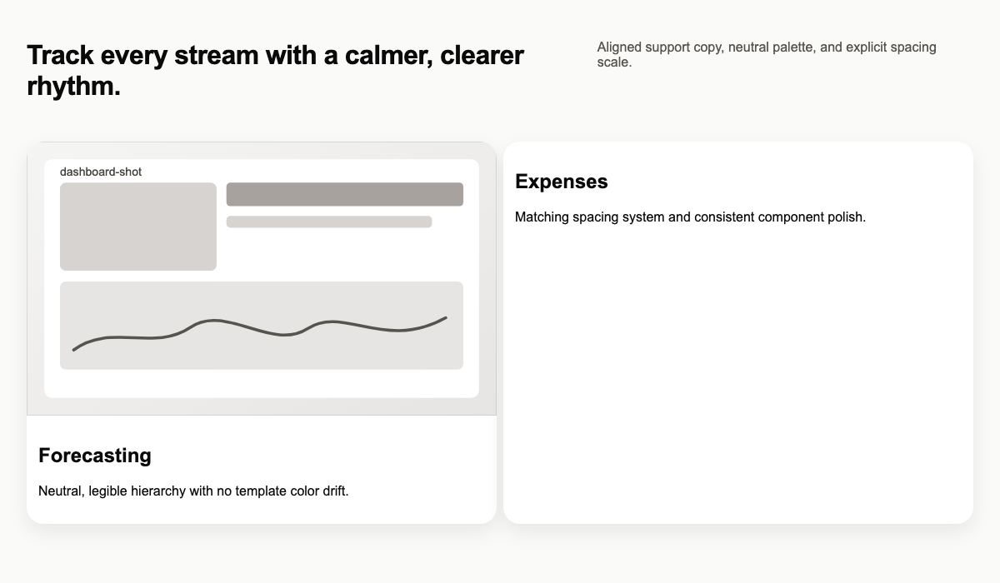

<div align="center">

# Ivan Creator Skills

**把“AI 做过了”变成别人一眼能看懂、愿意安装的成品。**

三款可验证的 Agent Skills：修掉界面的 AI 模板感、把抽象 Skill 变成价值封面，以及将关系中的数字、物件和定价权写成女性第一人称反转文章。

[](LICENSE)
[](#三款-skill)
[](#安装)
[](#安装)
[](#youmind-真实使用情况)

[立即安装](#安装) · [看前后对比](#01--ivan-human-ui) · [三个真实案例](#真实案例) · [10 分钟实测](docs/10-MINUTE-CREATOR-TEST.zh-CN.md) · [下载 ZIP](https://github.com/flychicken067/ivan-creator-skills/releases/latest)

</div>

---

## 不是更多提示词，而是三种可复用的交付能力

| 你遇到的问题 | 安装后的结果 |
| --- | --- |
| 页面能用，但像套模板：全部居中、颜色漂移、卡片堆叠、缺少真实证据 | `ivan-human-ui` 诊断具体问题，按明确约束修改，并留下可核验结果 |
| Skill 很有用，但封面只有图标或抽象插画，别人看不出为什么要装 | `ivan-skill-value-cover` 把人物、输入、处理和可带走的结果放进同一张价值封面 |
| 原文关系复杂，数字和物件很多，但改写容易变成性别互换摘要或真人指控 | `sun-study-female-reversal` 先拆定价机制，再写成明确标注虚构的女性第一人称反转 |

## 三款 Skill

### 01 · Ivan Human UI

> 让生成式界面从“能跑”走到“像人认真做过”。

它不会只说“更高级一点”。它会指出可以直接修改的结构、字体、颜色、间距、边框、截图和交互问题，完成修改后再用评分与资产检查决定是否交付。

| 使用前：模板感明显 | 使用后：层级清楚、证据可见 |
| --- | --- |
|  |  |

**适合：** 落地页、仪表盘、高保真原型、产品展示页、演示型网页。

**交付：** 精确代码修改、逐区 Before → After 理由、图片完整性检查、0–10 分质量评估。

[查看 Skill 原文](plugins/ivan-human-ui/skills/ivan-human-ui/SKILL.md) · [查看验证案例](plugins/ivan-human-ui/skills/ivan-human-ui/references/eval-results.md)

### 02 · Ivan Skill Value Cover

> 不解释方法论，先让人看见“装之前”和“装之后”。

它从 `SKILL.md` 或使用说明中提取真实用户、具体输入、关键处理和可用结果，同时生成 1:1 市场缩略图与 16:9 详情封面。没有证据的数字、品牌和结果不会被偷偷补上。

<p align="center">
  
</p>

**适合：** YouMind Skill 市场、GitHub README、发布帖、详情页与团队内部技能目录。

**交付：** 人物明确、输入可见、结果具体的双尺寸封面，以及可追溯的文案边界。

[查看 Skill 原文](plugins/ivan-skill-value-cover/skills/ivan-skill-value-cover/SKILL.md) · [查看案例规则](plugins/ivan-skill-value-cover/skills/ivan-skill-value-cover/references/examples.md)

### 03 · 孙学反转写作

> 她以为自己在试探关系，最后发现自己的试探也进入了对方的计算。

它先从原文中找出数字锚点、物件回声和谁在定价，再建立女性的身体、时间、劳动与退出成本账本，最后用可见证据完成反转。现实人物与争议必须区分事实、推断和虚构，不把写作机制包装成真人指控。

<p align="center">
  
</p>

**适合：** 长文拆解、叙事结构学习、女性第一人称虚构写作、镜像文章。

**交付：** 三个孙学机关、6–10 个女性反转节拍、完整文章，以及事实与虚构边界检查。

[查看 Skill 原文](plugins/sun-study-female-reversal/skills/sun-study-female-reversal/SKILL.md) · [查看结构来源说明](plugins/sun-study-female-reversal/skills/sun-study-female-reversal/references/source-analysis.md)

## 安装

### OpenAI Codex

```bash
npx skills add flychicken067/ivan-creator-skills --skill ivan-human-ui
npx skills add flychicken067/ivan-creator-skills --skill ivan-skill-value-cover
npx skills add flychicken067/ivan-creator-skills --skill sun-study-female-reversal
```

重启会话后，第一次测试时明确调用 `$ivan-human-ui`、`$ivan-skill-value-cover` 或 `$sun-study-female-reversal`。

### Claude Code

```text
/plugin marketplace add https://github.com/flychicken067/ivan-creator-skills.git
/plugin install ivan-human-ui@ivan-creator-skills
/plugin install ivan-skill-value-cover@ivan-creator-skills
/plugin install sun-study-female-reversal@ivan-creator-skills
```

### WorkBuddy / Doubao Workmates

从 [最新 Release](https://github.com/flychicken067/ivan-creator-skills/releases/latest) 下载文件名带 `-workbuddy.zip` 的对应安装包，再在 Skills 页面选择上传。这些包把 `SKILL.md` 放在 ZIP 根目录，适配 WorkBuddy / 豆包工作台的手动上传方式。启用前先检查包内容，并只用脱敏样例测试。

### SkillHub 公开发布

从 [最新 Release](https://github.com/flychicken067/ivan-creator-skills/releases/latest) 下载文件名带 `-skillhub.zip` 的对应发布包。该版本在 ZIP 根目录同时提供 `SKILL.md` 与 `icon.png`，用于 SkillHub 的“发布 Skill”表单；它与本地安装包分开，避免平台字段污染核心 Skill。

## 30 秒判断它值不值得装

1. 找一张你认为“能用但很像 AI”的页面截图，运行 `ivan-human-ui`。
2. 找一份别人看不懂价值的 `SKILL.md`，运行 `ivan-skill-value-cover`。
3. 找一篇关系叙事长文，运行 `sun-study-female-reversal`，检查事实、推断和虚构是否分开。
4. 只检查三件事：问题是否具体、前后差异是否明显、交付结果是否可继续使用。

完整脚本见 [10 分钟创作者测试](docs/10-MINUTE-CREATOR-TEST.zh-CN.md)。

## 真实案例

- [Ivan Human UI：从“能用”到“人一眼就懂”](docs/cases/ivan-human-ui.zh-CN.md)
- [Ivan Skill Value Cover：让陌生人先看懂，再决定安装](docs/cases/ivan-skill-value-cover.zh-CN.md)
- [孙学反转写作：结构可控的女性反转叙事](docs/cases/sun-study-female-reversal.zh-CN.md)

## YouMind 真实使用情况

2026-09-01 登录作者账号逐项核验：两款 Skill 均处于 **分享中**、版本均为 **v5**。YouMind 详情页显示 `孙学反转写作` 安装人数 **8**，`Skill 价值封面生成器` 安装人数 **9**。

| 孙学反转写作 · 安装人数 8 | Skill 价值封面生成器 · 安装人数 9 |
| --- | --- |
|  |  |

> 两个页面合计展示 **17 次安装**，但安装者可能重合，因此不能表述为“17 位独立用户”。YouMind 当前页面也没有提供运行次数、留存率或付费转化数据。

GitHub 是本项目的公开源码与安装入口；YouMind 页面承担实际展示和安装验证。本仓库不会把平台总用户规模写成本项目用户数，也不会把安装量写成使用活跃度。

## 可验证，不夸大

- Marketplace 校验只证明包结构可被识别，不代表每种请求都成功。
- 安装只证明平台接受了 Skill，不代表输出质量已经得到外部用户验证。
- 封面与原型负责解释价值，不冒充真实运行证据。
- 仓库不包含雇主、客户、凭证或非公开产品资料；详见 [SECURITY.md](SECURITY.md)。

## License

MIT。素材来源与第三方使用说明见 [THIRD_PARTY_NOTICES.md](THIRD_PARTY_NOTICES.md)。

<div align="center">

**先让一个陌生人看懂，再让一百个人安装。**

[开始 10 分钟实测](docs/10-MINUTE-CREATOR-TEST.zh-CN.md)

</div>
